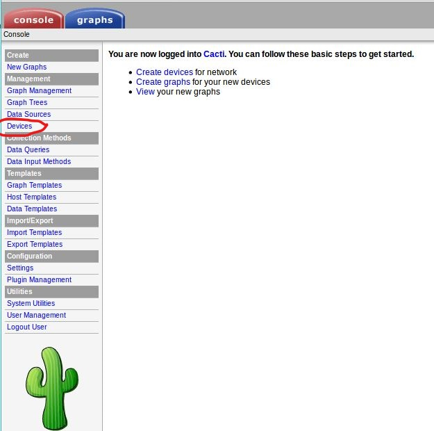
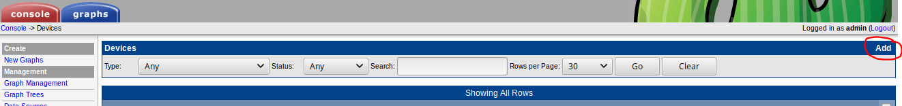
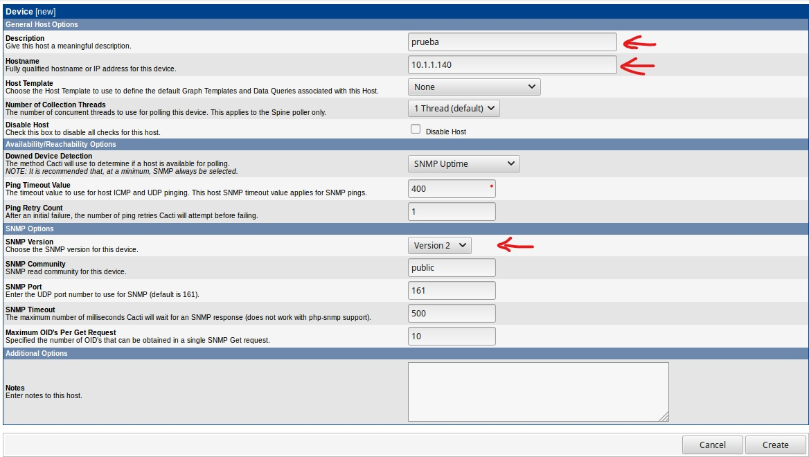
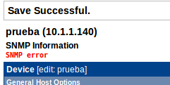
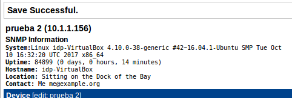

# Añadir un host

Una vez tengamos instalado Cacti, añadiremos el cliente. Para ello, desde el panel de administración, iremos a la pestaña "Console" y allí, en la columna de la izquierda, entrar en “Devices”.

Añadimos un nuevo dispositivo seleccionando “Add”.

En la nueva ventana solo hay que añadir dos datos, el primero la descripción de la máquina y en el segundo la IP.
Cuando hayamos insertado los datos, hacer click en "create".

Pueden ocurrir dos cosas:

- Si el cliente no tiene configurado el protocolo SNMP dará error

- Si está bien configurado se añadirá con normalidad

Una vez agregado, el dispositivo estará en el listado de dispositivos(Console>Devices) y veremos que el estado es de "Unknown", esto es debido a que todavía no hemos agregado una fuente de datos para graficar. 

Dar clic en el dipsositivo y seleccionar la opción de “Create graphs for this Host”

Hay diferentes opciones para crear gráficas, seleccionaremos la que nos interese.

Ya con las gráficas creadas para el nuevo dispositivo, después de unos minutos, el estado del mismo deberá cambiar a UP, de lo contrario verificar que SNMP funciona correctamente.

