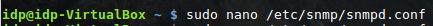
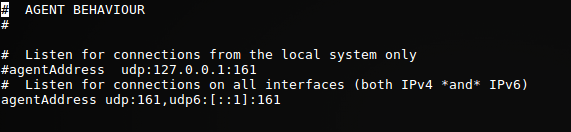
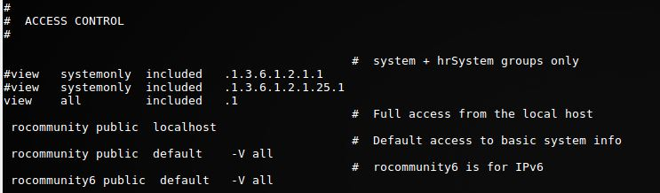

# Configuración del Cliente

***¿Qué necesitamos instalar en el equipo cliente?***

Como ya hemos visto anteriormente, la herramienta de monitorización Cacti utiliza el protocolo de intercambio de información entre redes SNMP, un protocolo de la capa de aplicacion.
Puesto que Cacti utiliza dicho protocolo, debemos instalar este servicio en el cliente. Para ello haremos uso de los siguientes comandos:

```bash
sudo apt-get install snmp
sudo apt-get install snmpd
```

***Qué debemos hacer una vez instalado el servicio SNMP?***

Una vez instalado, se creará un archivo de configuración, el cual modificaremos para que nuestro servidor pueda utilizar el servicio snmpd para obtener información de administración de nuestra red. 

Accederemos al archivo de la siguiente manera: 



Con el comando anterior hemos accedido al fichero /etc/snmp/snmpd.config y nos disponemos a editarlo con el editor de texto nano.

Los cambios que realizaremos a continuación están orientados a que el cliente permita comunicarse con el servidor mediante el protocolo SNMPD.
Realizaremos las siguientes modificaciones: 

Comentar la opción que solo permita la escucha de las conexiones del sistema local, y descomentar la opción que nos permite escuchar a todas las interfaces:




Añadir esta vista, quitando las que hay:

```bash
view    all     included        .1
```

Añadir estos controles de acceso:

```bash
rocommunity public  default    -V all
rocommunity6 public  default   -V all
```



*** Una vez configurado nuestro fichero, ¿qué debemos hacer?***

El siguiente paso es reiniciar el servicio: 


```bash
sudo /etc/init.d/snmpd restart
```

Y por último asegurarnos desde el servidor que el cliente se encuentra a la escucha: 

```bash
snmpwalk -v2c -c public IP
```

