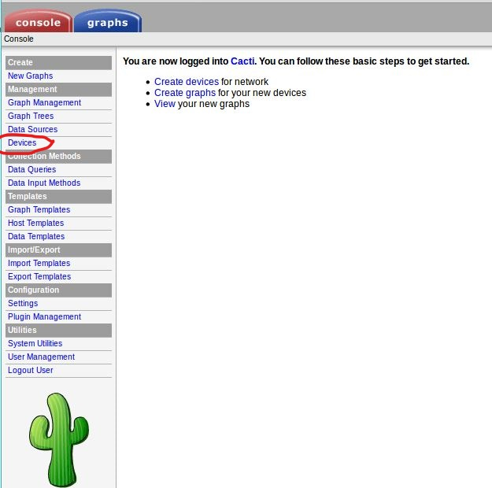
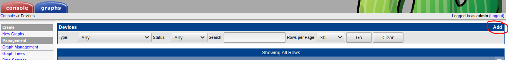
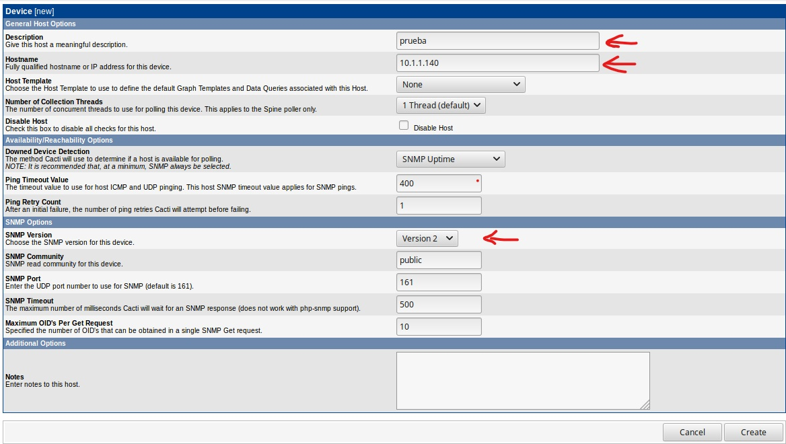
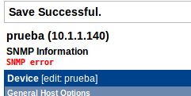
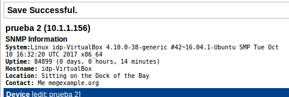

# Configuración de Cacti

Una vez tengamos instalado Cacti, añadiremos el cliente. Para ello, desde el panel de administración, iremos a la pestaña "Console" y allí, en la columna de la izquierda, entrar en “Devices”.

Añadimos un nuevo dispositivo seleccionando “Add”.

En la nueva ventana solo hay que añadir dos datos, el primero la descripción de la máquina y en el segundo la IP.
Cuando hayamos insertado los datos, hacer click en "create".

Pueden ocurrir dos cosas:

- Si el cliente no tiene configurado el protocolo SNMP dará error

- Si está bien configurado se añadirá con normalidad

