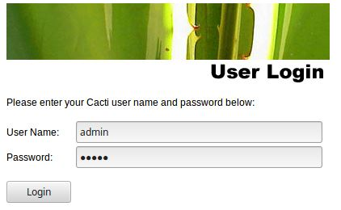

# Instalación Cacti

1. Instalación de Cacti en LinuxMint-18.3

`sudo apt-get install cacti`

Cuando ejecutamos el comando anterior, se abre el asistente de la instalación.

2. Elegimos Apache2 como servidor web. (Instalado previamente).

3. Configurar la base de datos para Cacti

4. Introducir contraseña de root de MySql y confirmarla

5. Abrimos un navegador (recomendable chrome o firefox) e introducir la siguiente dirección:

http://IP_DEL_SERVIDOR/cacti o http://localhost/cacti

6. Seleccionar "New install"

7. Verificar que todos los parámetros están en verde

8. Ya se ha instalado Cacti, ahora introduciremos el usuario “admin” y contraseña “admin“ que están establecidos por defecto. Una vez introducidos nos pedirá que pongamos una contraseña nueva.

    

9. Y ya tenemos acceso a Cacti

